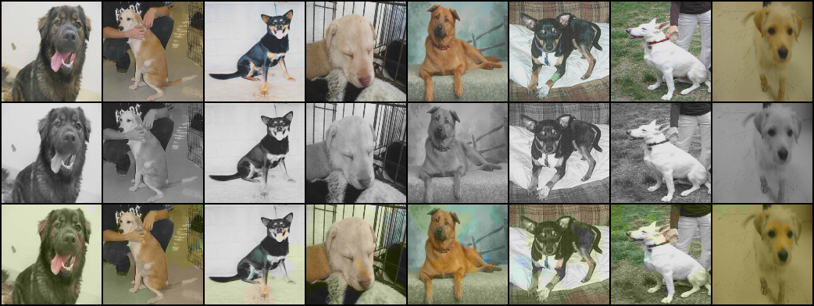
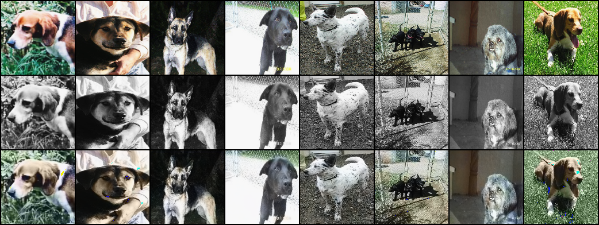
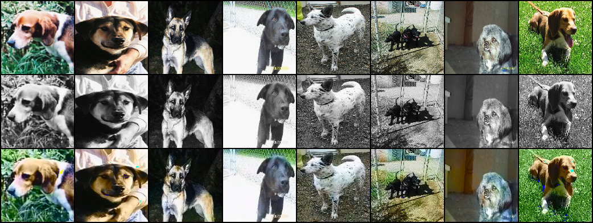
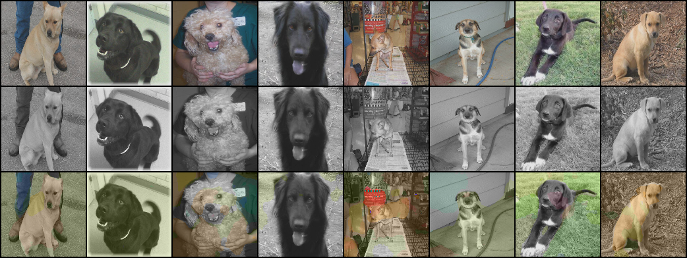

# Image colorization
Colorization of grey-scale images is a challenging and ill-posed task for neural networks. In the below image, the top row shows the original image, the middle row shows the grey-scale version of the image which is also the input to the convolutional neural network and the bottom-row contains the color reconstruction after the network. 

The task is inherently ill-posed as there exists many objects with a wide varienty of colors which, in grey-scale look similar or even identical. This makes it very hard for the neural network to propose colors. Nonetheless, deep convolutions networks show the capability to take on this task and, in many cases, are able to provide reasonable and convincing colorized versions of the provided grey-scale images. 

## Pre-processing
While it is possible to directly estimate the red, green and blue channel of an image based on the grey-scaled version, this is not an optimal formulation of the problem. Assuming we are given the grey-scaled version of the image it remains to estimate the color information, thus it makes sense to represent images in the [YUV color-space](https://en.wikipedia.org/wiki/YUV). In that case, the network only needs to esimate the U and V channel whereas the (given) Y channel can later be used to reconstruct the RGB version of the image. 

## Regression on U and V
It is [well known](https://arxiv.org/pdf/2008.10774.pdf) that direct regression of the U and V channel (e.g. via the L1-norm) yields *de-saturated* results. 

This is a consequence of the fact that for each part of image, many plausible colors exist. Regression with the L1- (or L2)-norm cause the network to compromise on a in-between color in order to minimize the loss. It is possible to artificially increase the saturation of the obtained images to compensate for this but, since there is no additional information gain involved in this, this is also not the best way of tackling this problem.

The above image shows the same results as before but with the saturation of the reconstructed color-version further being boosted.

## Colorization as a classification problem

[R. Zhang, P. Isola and A.A. Efros](https://richzhang.github.io/colorization/) propose to treat colorization as a classification rather than a regression problem. They quantize the color-space into a discrete set of bins and assign each pixel to the most appropriate bin. Then they train a classification network which targets to predict the correct *color-class* (bin). They use a weighted loss per class as the color-space of natural images is heavily dominated by unsaturated colors (e.g. due to large portions of the blueish sky). They weight rare colors higher by estimating the color-bin distribution and assigning each bin a weight proportional to the reciprocal of that propability. With this, they are able to achieve naturally looking, well saturated color images directly. 

Result of this procedure can be seen in the below image (no additional post-processing applied)
 

